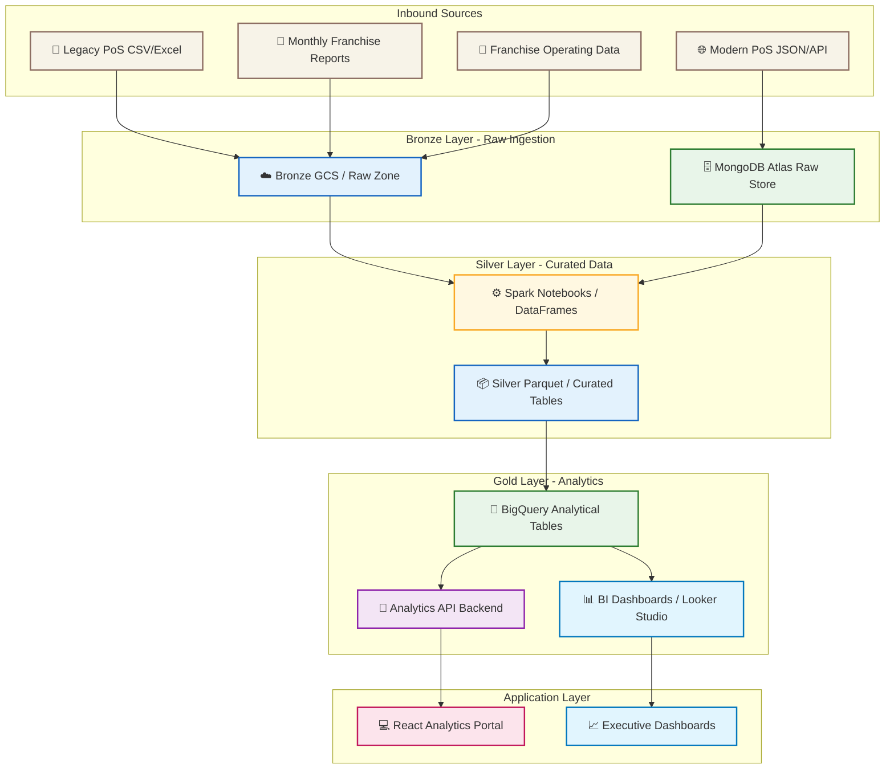

# Eta-Beta-Pi Technical Solution: GCP + MongoDB Atlas + Spark

## 1. Overview

This technical solution describes an end-to-end architecture for Eta-Beta-Pi, starting from diversified PoS sources and franchise reporting, through notebook-based Spark data engineering, into a medallion architecture, and ending with data insights and visualization. The core approach uses Google Cloud Platform for infrastructure, MongoDB Atlas for flexible semi-structured data staging, and Spark DataFrames for ELT-oriented transformations.

## 2. Key Requirements

- Ingest data from heterogeneous PoS systems, monthly franchise reports, and franchise operating data.
- Support ELT with notebook-based Spark and DataFrames.
- Implement medallion architecture (Bronze / Silver / Gold) for data quality and scalability.
- Provide a large tabular model for analytics and BI visualization.
- Use Google Cloud infrastructure and MongoDB Atlas.
- Support front-end analytics dashboards and a back-end data API layer.

## 3. Inbound Data Sources

### 3.1 Diversified PoS Systems

Eta-Beta-Pi outlets use varying PoS vendors and versions. Example source formats include:
- CSV/Excel exports from legacy PoS systems.
- JSON or XML feeds from modern PoS APIs.
- SQL dumps or API records from franchise partner systems.
- Flat files from older systems delivered by secure FTP.

### 3.2 Monthly Franchise Reports

Franchisees submit monthly reports with revenue, labor, inventory, and operational costs. These are standardised into templates such as:
- Excel/CSV monthly summary reports.
- PDF or structured email attachments (later converted to structured files).

### 3.3 Franchise Operating Data

The system also ingests franchisee-owned cost and tax data, such as:
- Payroll and labor costs.
- Utilities and rent.
- Supplier invoices and inventory receipts.

## 4. Medallion Architecture

The proposed data pipeline uses a three-tier medallion architecture:

- **Bronze layer**: Raw data ingestion exactly as received from PoS, reports, and franchise inputs.
- **Silver layer**: Cleaned, standardized, and conformed data with consistent schemas and normalized entities.
- **Gold layer**: Analytics-ready aggregated datasets and large tabular models for reporting and BI.

### 4.1 Bronze Layer

- Store raw records in Google Cloud Storage (GCS) as JSON/CSV/Parquet.
- Ingest structured PoS extracts and semi-structured documents into MongoDB Atlas as a raw operational store.
- Retain full fidelity for audit and lineage.

### 4.2 Silver Layer

- Use Spark notebooks to clean and normalize data into silver tables.
- Apply schema reconciliation across PoS systems.
- Standardize product, outlet, time, and transaction dimensions.
- Store curated parquet/snowflake-backed tables in GCS and/or Dataproc metastore.

### 4.3 Gold Layer

- Build analytical tables for sales, margins, inventory, promotions, and franchise costs.
- Produce large tabular models optimized for BI and reporting.
- Load gold tables into BigQuery for fast query performance and direct visualization.

## 5. Notebook-Based Data Engineering with Spark DataFrames

### 5.1 Why Notebook-Based Engineering

- Enables exploratory ETL development and rapid iteration.
- Supports data profiling, schema evolution, and inline validation.
- Fits educational and assignment requirements by showing transformation logic in code.

### 5.2 Spark + DataFrames Workflow

The workflow in a notebook:
1. Read raw data from GCS or MongoDB Atlas.
2. Apply schema inference or explicit schema definitions.
3. Transform data using Spark DataFrame operations.
4. Clean duplicates, handle missing values, and normalize values.
5. Write the results to silver and gold layers.

### 5.3 Example Notebook Flow

- Notebook 1: `ingest_bronze.ipynb`
  - Load CSV, JSON, and Excel exports.
  - Store source files in GCS bronze zone.

- Notebook 2: `transform_silver.ipynb`
  - Read raw bronze files.
  - Standardize columns and convert types.
  - Write silver parquet tables.

- Notebook 3: `build_gold.ipynb`
  - Aggregate sales and margins.
  - Build fact and dimension tables.
  - Load final datasets into BigQuery.

## 6. ELT Approach

The ELT model is central to this design:
- Extract: capture raw files and PoS feeds.
- Load: store data in Bronze layer and MongoDB Atlas.
- Transform: use Spark DataFrames to convert from Bronze to Silver and Gold.

Benefits:
- Raw data remains available for reprocessing.
- Transformations are reusable and traceable.
- BigQuery or other analytical targets only receive curated data.

## 7. Large Tabular Model for Visualization

The gold layer should include one or more wide tabular fact tables that support fast analytics:
- `fact_revenue_margin`: one row per outlet-day-product with revenue, cost, margin, discounts, and promotion attributes.
- `fact_franchise_costs`: daily or monthly cost rows aligned to outlets and categories.
- `dim_outlet`, `dim_product`, `dim_time`, `dim_promotion`, `dim_franchisee`.

This tabular model supports Pivot-style queries and BI tools that expect denormalized grids.

## 8. Technology Stack

### 8.1 Google Cloud Components

- **Google Cloud Storage (GCS)**: raw and curated staging zones.
- **Dataproc or Vertex AI Workbench**: notebook-based Spark execution.
- **BigQuery**: gold analytics tables and fast query engine.
- **Cloud Functions / Cloud Run**: ingestion endpoints and API services.
- **Secret Manager**: secure credentials for Atlas and GCP.
- **Cloud Composer / Workflows** (optional): orchestration if scheduling is needed.

### 8.2 MongoDB Atlas Integration

- Use Atlas as a flexible staging datastore for semi-structured PoS and operational records.
- Ingest raw JSON payloads from modern PoS systems directly into Atlas collections.
- Use Atlas connectors or Spark MongoDB connector to read from Atlas into Spark notebooks.
- Optionally store metadata, audit logs, or operational transaction histories in Atlas.

### 8.3 Spark & DataFrames

- Apache Spark for large-scale transformation.
- Use Spark DataFrames with explicit schemas and SQL expressions.
- Develop Spark notebooks in Python (PySpark) or Scala depending on team preference.

### 8.4 BI / Visualization

- **Looker Studio** or **Tableau** for dashboards and executive reporting.
- **Custom web portal** built with React and a charting library for tabular exploration.
- Use BigQuery as the BI source for dashboards.

### 8.5 Back-End API and Application Layer

- **FastAPI** or **Flask** for Python-based REST APIs.
- **Node.js / Express** for JavaScript-based backend if a JS stack is preferred.
- APIs can serve:
  - filtered analytics views for outlet managers
  - metadata and provenance information
  - custom report endpoints

### 8.6 Front-End Technologies

Option 1: BI-first approach
- Use Looker Studio or Tableau directly on BigQuery.
- Build dashboards for sales, margins, product performance, and outlet KPIs.

Option 2: Custom analytics portal
- **React** for UI.
- **Material UI** or **Ant Design** for components.
- **AgGrid** for large tabular data interaction.
- **Recharts** or **Victory** for charts.
- Backed by FastAPI/Express APIs for secure data access.

## 9. Solution Architecture Diagram

## 10. Business Process Flow Mapping to Technical Components

This section maps the business process flow for Eta-Beta-Pi to the technical architecture components deployed in the solution.

### 10.1 Business Process: Order & Sales Capture

- Business step: Customer orders are recorded at the outlet PoS.
- Technical components:
  - Legacy PoS CSV/Excel export or modern PoS JSON/API feed.
  - Raw Bronze ingestion into GCS and MongoDB Atlas.
  - Spark notebooks that normalize sales transactions into silver sales tables.
  - Gold analytical tables in BigQuery for revenue and product performance.

### 10.2 Business Process: Franchise Monthly Reporting

- Business step: Franchisees submit monthly revenue, labor, inventory, and cost reports.
- Technical components:
  - Monthly franchise reports uploaded to GCS bronze zone.
  - Spark data engineering to standardize report schemas and quality-check the data.
  - Silver tables for consolidated outlet-level reporting.
  - Gold tables that join monthly financials with sales and margin data.

### 10.3 Business Process: Operating Cost Tracking

- Business step: Franchise operating costs are collected to monitor profitability.
- Technical components:
  - Franchise operating data loaded into the Bronze layer from CSV/Excel or API feeds.
  - MongoDB Atlas may store semi-structured invoices and payroll entries.
  - Spark transformations create silver cost and expense tables.
  - Gold analytics combine cost, revenue, and margin for outlet profitability dashboards.

### 10.4 Business Process: Data Validation & Quality

- Business step: Ensure data is accurate, complete, and reconciled across outlets.
- Technical components:
  - Notebook-based validation logic in Spark to identify missing values, duplicates, and inconsistencies.
  - Silver layer design enforces standardized dimensions for outlet, product, time, and promotion.
  - Metadata and lineage stored in Atlas or BigQuery to support auditing.

### 10.5 Business Process: Analytics & Decision Support

- Business step: Executives, finance, and operations analyze menu performance, promotions, and margins.
- Technical components:
  - Gold BigQuery analytical tables optimized for BI.
  - BI dashboards built with Looker Studio, Tableau, or a custom React portal.
  - Analytics API backend that exposes filtered data and drill-down metrics to portal users.

### 10.6 Business Process: Franchise Self-Service Reporting

- Business step: Franchise owners view their own outlet performance and compare against benchmarks.
- Technical components:
  - Role-based tenant filtering in the API backend.
  - React analytics portal for interactive table views, charts, and KPI widgets.
  - Data security enforced through GCP IAM, Atlas access controls, and application auth.

### 10.7 Business Process: Continuous Improvement

- Business step: Refine the data pipeline and add new sources as franchise systems evolve.
- Technical components:
  - Modular Spark notebooks for easy addition of new PoS source formats.
  - Medallion architecture that supports reprocessing from raw Bronze data.
  - Optional orchestration with Cloud Composer / Workflows for scheduled pipeline runs.

## 11. Detailed Front-End / Back-End Discussion

### 10.1 Back-End Architecture

- **Ingestion APIs**
  - Cloud Functions or Cloud Run endpoints receive PoS payloads.
  - Endpoint validates payload, writes raw records to Atlas, and stores file metadata in GCS.
- **Notebook ETL/ELT**
  - Spark notebooks read bronze raw data from GCS and Atlas.
  - Transformations produce silver and gold results.
- **Analytics API**
  - FastAPI/Express provides filtered queries, aggregated metrics, and drill-down endpoints.
  - Auth via OAuth or service accounts, with role-based access control.
- **Metadata and lineage**
  - Store pipeline metadata in Atlas or BigQuery to track source records, job runs, and data quality.

### 10.2 Front-End Architecture

- **Dashboard layer**
  - Use Looker Studio or Tableau directly on BigQuery for executive dashboards.
  - Build KPI tiles, trend charts, and product heatmaps.
- **Custom web portal**
  - React app for franchise-level self-service and tabular analysis.
  - Use AgGrid for large table browsing and export.
  - Use charts for sales trends, margin drivers, and outlet comparisons.
- **Access control**
  - Implement login and tenant-aware data filtering by franchise/outlet.
  - Provide different UI views for HQ users versus franchise owners.

## 11. Implementation Phases

### Phase 1: Prototype and Bronze Layer

- Define data source inventory and collect sample PoS exports.
- Build raw ingestion pipelines into GCS and MongoDB Atlas.
- Create Spark notebooks to load raw data.

### Phase 2: Silver Layer and Metadata

- Develop schema standardization and cleaning notebooks.
- Create silver tables for outlets, products, sales, and costs.
- Implement data quality checks and metadata capture.

### Phase 3: Gold Layer and BI

- Build fact tables and large tabular models in BigQuery.
- Create dashboards and analytic reports.
- Expose analytics through APIs and a React portal.

### Phase 4: Operationalisation

- Add orchestration with Cloud Composer / Workflows if needed.
- Implement monitoring, alerting, and pipeline retries.
- Roll out training and documentation for franchise users.

## 12. Summary

This technical solution combines Google Cloud, MongoDB Atlas, and Spark notebooks to deliver a robust ELT pipeline from diversified PoS sources to analytics insights. A medallion architecture ensures data quality and traceability, while BigQuery and modern BI tools support large tabular visualization. The front-end/back-end design provides flexibility for both out-of-the-box dashboards and a custom analytics portal.
